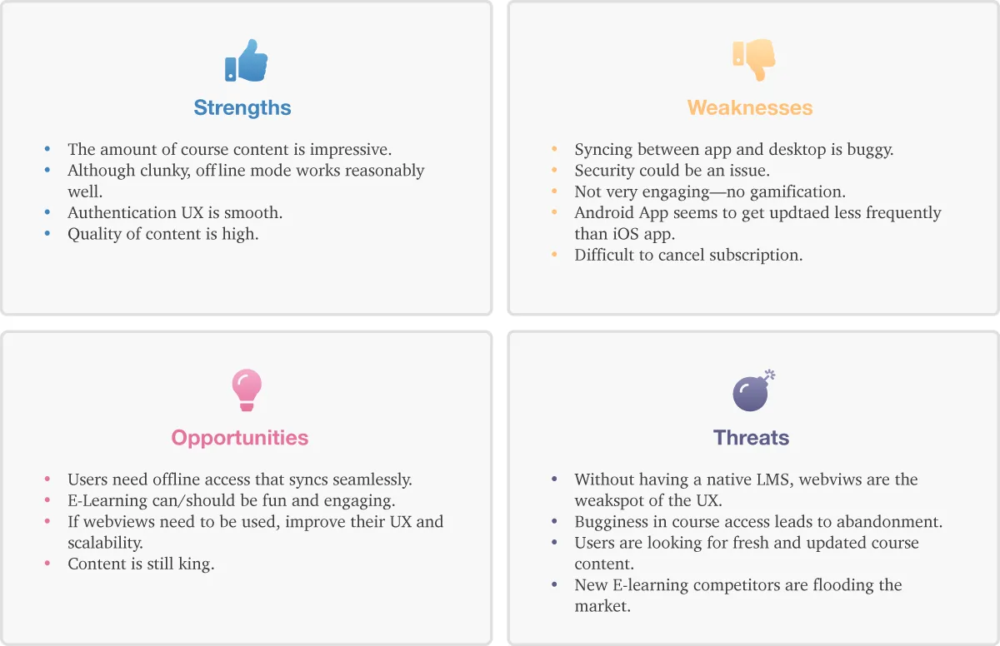
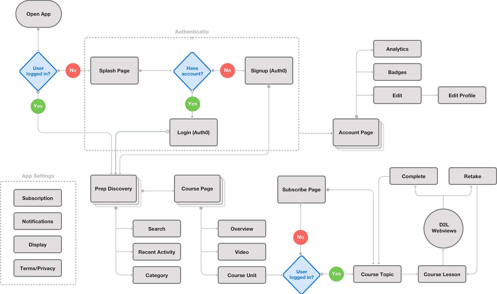
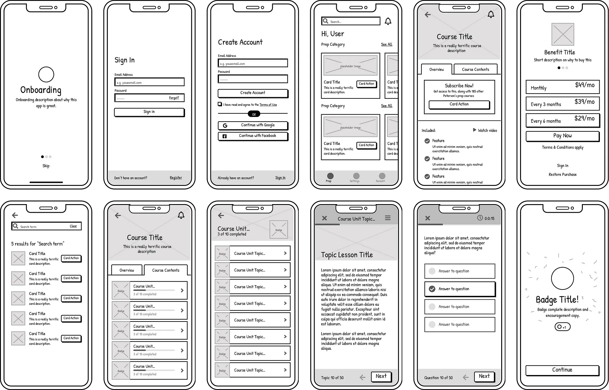
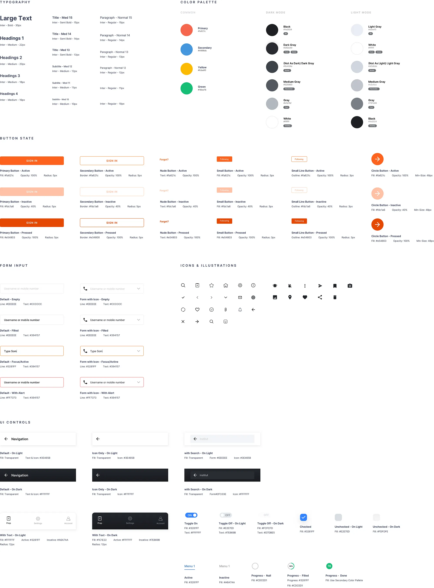
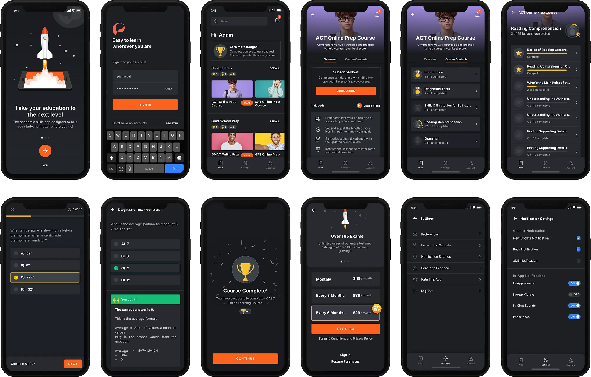

## Introduction
In 2017, Peterson’s DTC test prep sales were just $50k annually. The technical solution was a mere Stripe payment form on an outdated .NET website. After standing up a POC using WordPress, WooCommerce, and a minimally customized Storefront theme, sales have grown to an estimated $1mil in 2021. To bolster the growth in sales, it was decided in Q2 of 2020 that we’d launch native iOS and Android apps to replace the default responsive LMS course content with a greatly improved user experience.

Tech teams were put in place and I was brought into the project as the design lead after an unsatisfactory attempt by an outsourced designer. The timeframe was tight — 4 months to ideate, research, design, build and test 2 native apps.

## Design Methodology
When working on a new project, I begin my process with design thinking and gathering generative research through empathy and a deeper understanding of user needs and desires. Afterward, I’ll combine the systems and design thinking methodology during the phases of evaluating, defining, and developing the product. I’ll consider the big picture first and the specific interactions later. What are the core components in the product, how are they connected, what does the overall purpose of these elements serve? Do these elements solve my persona’s problems? By understanding the inter-relatedness of the collective system, I can better design for the user journey and behavior through the entire ecosystem.

## User Research
### Who’s the target audience?
The 185 test prep courses Peterson’s offers cast a pretty large net on the target users. At the youngest, it’s 16–18-year-old prospective college students looking to improve their score on the ACT or SAT. Somewhere in the middle, it’s active-duty military personnel wanting to take the ASVAB to further their education. And at the oldest, it’s middle-aged professionals looking towards a second career in Real Estate.

### What’s the general problem?
Test prep, specifically on a mobile device, is difficult. Yet with mobile usage increasing, it’s inevitable. There are complex math equations, lengthy passages, and interactive course content to account for. None of our direct competitors offer a good user experience. Sure, there are specialist apps like Duolingo, Masterclass, and Treehouse with splendid interfaces — But those barely touch the surface of what Peterson’s offers. Our goal was to create a mobile experience that makes it as easy (and rewardable) for the user to move through course content.

### Competitive Analysis
To gain a better understanding of the market, I did an analysis of our primary competitor — Coursera. I build a SWOT profile and conducted a UX analysis of their product. My key findings were:

* While functional, the design wasn’t engaging.
* While offline courses worked, many of the negative reviews were attributed to syncing bugginess.
* The breadth of content was impressive.
* Account management was difficult to use since it’s outside of the scope of the Apple/Google Play subscription management service.
* It was apparent that Coursera also used webviews for much of their content, and the difference between native and webview content was noticeable.

### User Personas
Based on the generative user research I gathered, I identified three target users to help understand their goals and expectations from the experience of using the app. Meet June, David, and Frank.

**June:**
16-year-old high school student

June is looking to attend a good college. Her first attempt at the ACT wasn’t quite enough to get her there. One of her best friends used Petersons’ printed guide to increase his score by 5 points. June feels like she learns better digitally and opts for the online guide. June is hoping to chip away at the course content throughout the day as she goes about her already busy school/extracurricular schedule.

**David:**
22-year-old Army servicemember

David has aspirations of furthering his education and going to college for Criminology after his duty in the Army. He’s interested in taking the ASVAB to get a head start on his education. He’s deployed in Afghanistan so there are long stretches where he doesn’t have internet access. Offline test-taking would help him prepare at his pace during these long stretches.

**Frank:**
40-year-old electrician

Frank has been an electrician for nearly 20 years. He’s seen the recent surge in house flipping and the subsequent need for real estate agents. He even wouldn’t mind taking his shot at flipping sometime in the future. To start, he figured getting his real estate license would be a good first step. His schedule is busy though, so he’d like a way to study on his phone during the day (between jobs) that would sync to his computer for night sessions.

## Define and Synthesize
### Problem Statement
Users need a way to access Petersons’ quality test prep content from their mobile devices because they are busy and often times find themselves on their phones instead of a laptop/desktop computer. Both the subscription and the course content experience need to be easy and approachable. Content needs to sync across devices.

### Hypothesis
The current mobile responsive eCommerce experience is cumbersome at best. Despite that, 60% of our test prep users do so on their mobile devices. This app will lead to higher customer satisfaction, more engagement, and greater sales.

### Solution
Design both a native iOS and Android app that enables the user to purchase, access, and manage a test prep subscription.
Use Auth0 for SSO authentication so user data can be synced across platforms.
Integrate course content as webviews so the course data can be synced across platforms.
Implement a reward/badge system to encourage engagement for longer, more laborious courses.
Adhere to all of Apple’s Human Interface Guidelines and Android’s Design Guidelines while maintaining a fresh imagination.

## User Flows
Leveraging research on customers’ needs, competitor analysis, and mobile best practices, I build a user flow that was used to guide the lifecycle of product development.

## Wireframes
During the wireframe stage, we started having daily design calls to iterate over and approve all screens. Some calls would take 15 minutes, and other 2 hours. Afterward, I tested the prototype with 3 participants to validate my initial design ideas.

## Design System
The design system was built as part of the component library in Sketch, along with the ability to export it to Zeplin. Inter was used for all typography, colors were identified as dark vs. light mode, and most non-native UI components were accounted for.

## Final Design
The final design revolved around the concepts of flexibility, clarity, and friendliness. Additionally, I designed for both light and dark mode. Apple’s Human Interface Guidelines and Android’s Design Guidelines were carefully considered.

## First Round of User Testing
Once we had an alpha of the app based on the final designs, I conducted two rounds of user testing on usertesting.com. I wrote the acceptance criteria for candidates and within a day, we had a handful of testers.

After combing through hours of video, I quickly started to draw conclusions:

* Our pseudo-native implementation of Auth0 was a hit. Users commented on how smoothly it worked.
* Users loved the dark and modern look of the app.
* Overall, it was easy to create an account, find a course, and start it.

Not all feedback was positive. Once into a course, users griped about how clunky the experience was. The actual course content was being served as webviews directly from D2L’s Brightspace. And sadly, Brightspace used iFrames to insert content. Due to cross-origin policy and Brightspace being on another domain, we had little control over styling the course content. Also, because of this, the light and dark mode toggling wasn't working.

## Technical Hurdles
Two of the most challenging technical aspects were:

1. Since we’re using Auth0 for SSO authentication, designing the hosted Auth0 login and signup pages to reflect the app both visually and functionally. Because of this, I wrote a custom UI switcher in JS that served up a completely optimized app experience via JS and CSS. After two rounds of user testing, applicants didn’t notice that the login and signup weren’t native experiences and actually commented on smooth the UI was.
2. Since actual course content was being served as webviews, I needed to find a way to style them that wouldn’t adversely affect the desktop and mobile responsive views. While D2L looks okay on desktop, it certainly didn’t carry the same sexy visuals as the new app. Additionally, light and dark mode didn’t work. Again, I wrote a little JS to detect the user agent, and if it matches iOS or Android native, I served a specific stylesheet. I was also able to use the `prefers-color-scheme` media query and standard CSS variables to easily toggle dark and light modes.

### Production JS:
~~~function loadCSS() {
  var userAgent = window.navigator.userAgent.toLowerCase(),
      safari = /safari/.test(userAgent),
      ios = /iphone|ipod|ipad/.test(userAgent),
      android = /wv/.test(userAgent);
    if ((ios && !safari) || (android)) {
      document
       .getElementsByTagName('head')[0]
        .insertAdjacentHTML(
          'beforeend',
          '<link rel=”stylesheet'
          href="https://learn.petersons.com/shared/HTML-Template-Library/HTML-Templates-V3/assets/css/app-styles.css">'
        );
    }
}
document.addEventListener(“DOMContentLoaded”, loadCSS);
~~~

### Production CSS:
~~~
/* Light mode (default) */
:root {
  --h-color: #1e2024;
  --p-color: #383b3e;
  --bg-color: #ffffff;
  --border-color: #d0d6de;
  --box-shadow-color: rgba(0, 5, 10, 0.1);
}
/* Dark mode */
@media (prefers-color-scheme: dark) {
  :root {
    --h-color: #fff;
    --p-color: #b1b7bf;
    --bg-color: #292a2e;
    --border-color: #3c424a;
    --box-shadow-color: rgba(0, 5, 10, .08);
  }
}
~~~

