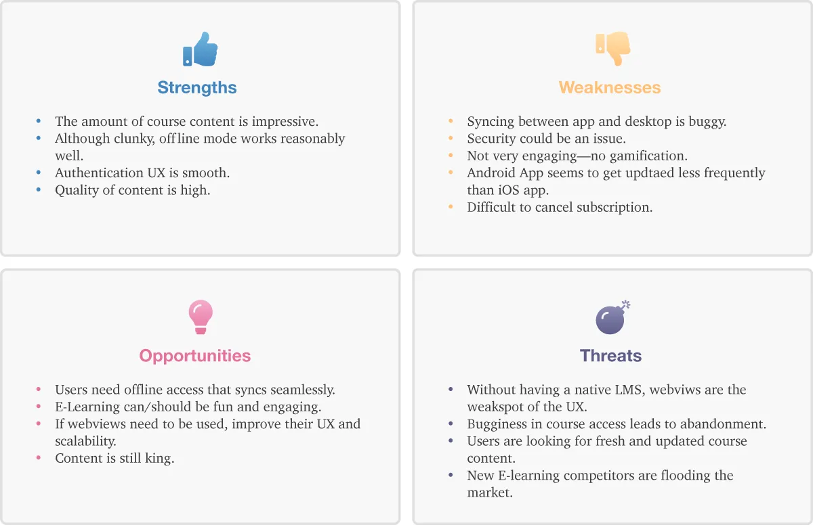
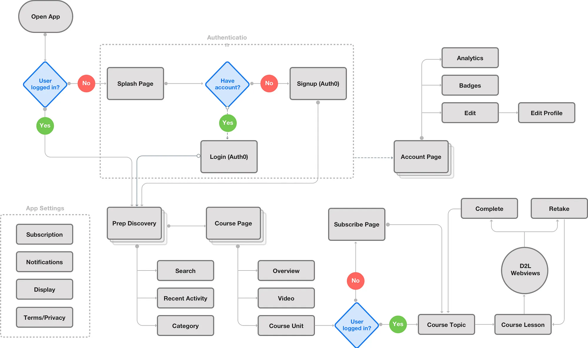
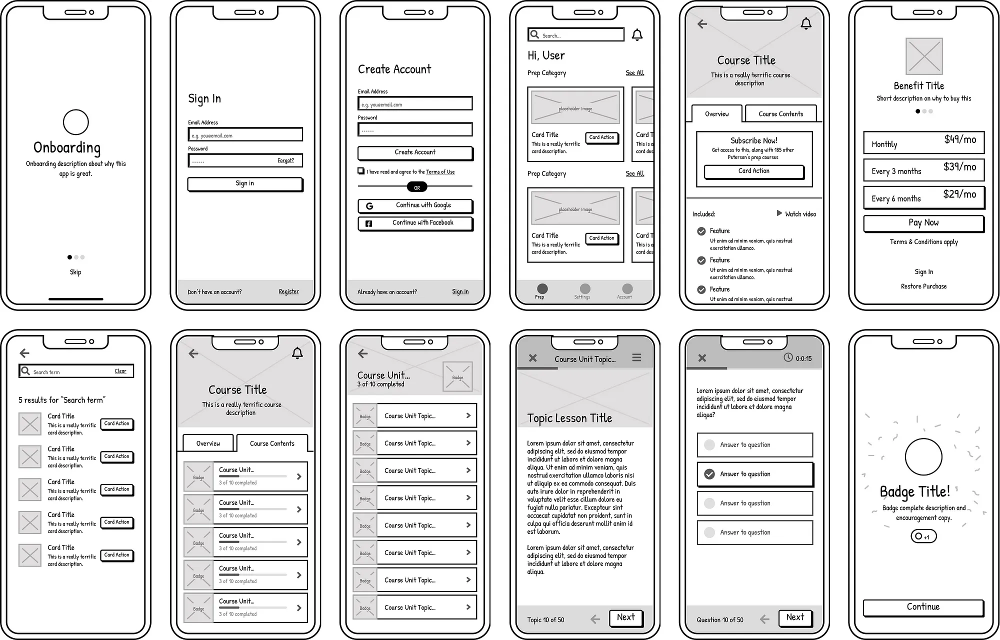
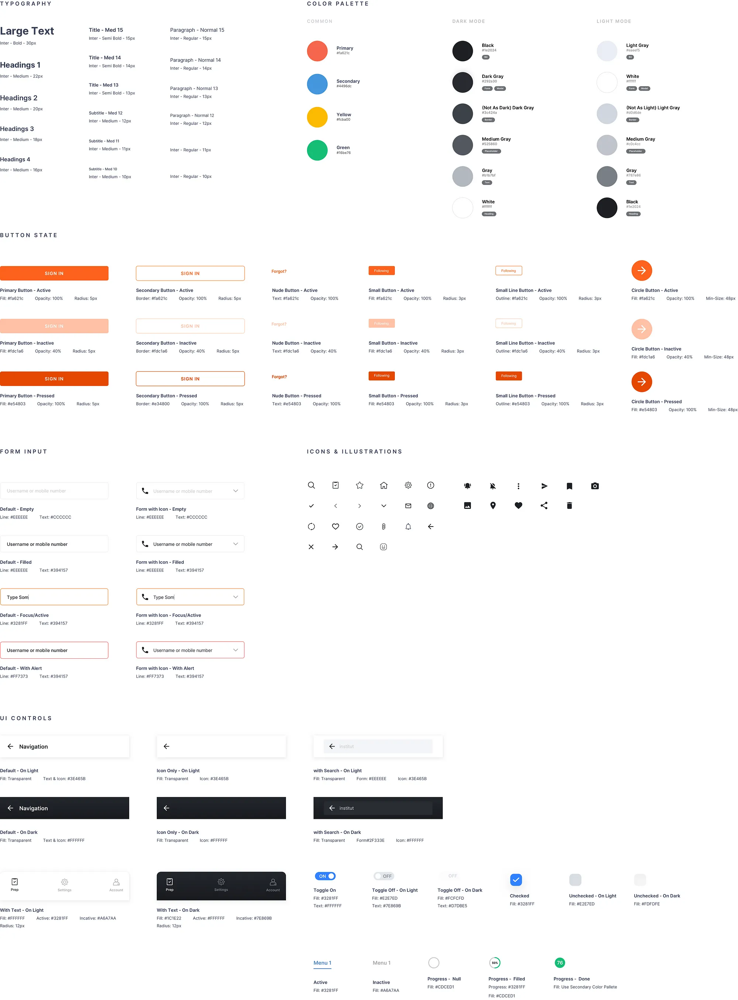
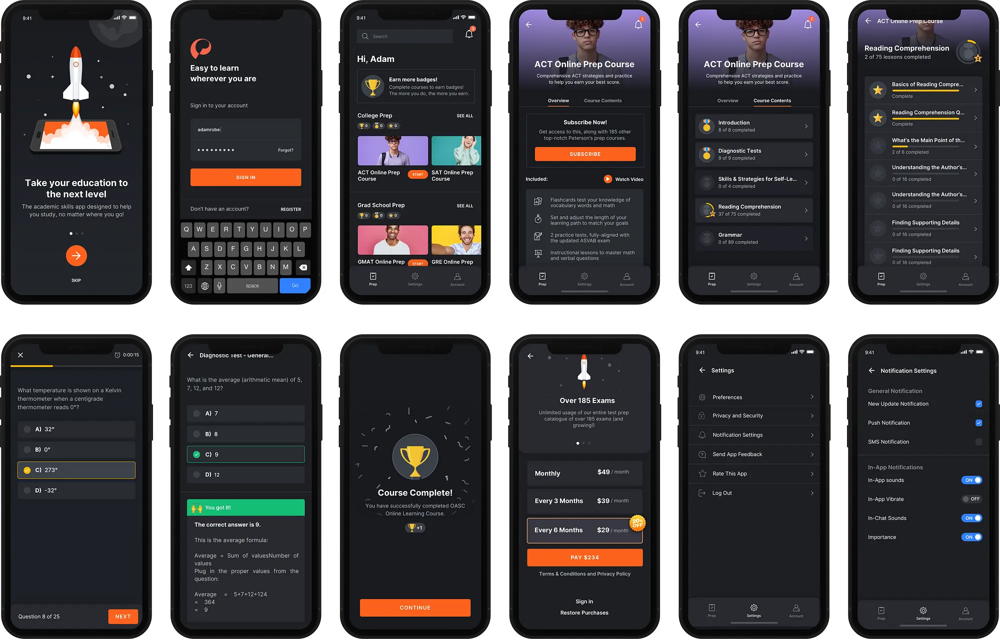

## Introduction

In 2017, Peterson's DTC test prep sales were $50K a year. The "ecommerce experience" was a Stripe payment form on an outdated .NET site. After standing up a POC with WordPress and WooCommerce, sales grew to an estimated $1M by 2021. In Q2 2020, we decided to go native -- iOS and Android apps to replace the clunky responsive LMS experience with something actually built for mobile.

I came in as design lead after an outsourced designer didn't work out. Four months to ideate, research, design, build, and test two native apps.

## User Research
### Who's the target audience?
The 185 test prep courses Peterson's offers cast a pretty large net on the target users. At the youngest, it's 16–18-year-old prospective college students looking to improve their score on the ACT or SAT. Somewhere in the middle, it's active-duty military personnel wanting to take the ASVAB to further their education. And at the oldest, it's middle-aged professionals looking towards a second career in Real Estate.

### The core problem

Test prep on mobile is hard. You're dealing with complex math equations, long reading passages, and interactive course content -- none of which are easy to render well on a phone screen. No direct competitor was doing it well. Apps like Duolingo and Masterclass look great, but they're working with fundamentally simpler content. Peterson's offers 185 courses across dozens of test types. The goal was to make it easy (and rewarding) for users to move through that content on a phone.

### Competitive Analysis
To gain a better understanding of the market, I did an analysis of our primary competitor — Coursera. I build a SWOT profile and conducted a UX analysis of their product. My key findings were:

* While functional, the design wasn't engaging.
* While offline courses worked, many of the negative reviews were attributed to syncing bugginess.
* The breadth of content was impressive.
* Account management was difficult to use since it's outside of the scope of the Apple/Google Play subscription management service.
* It was apparent that Coursera also used webviews for much of their content, and the difference between native and webview content was noticeable.

### User Personas
Based on the generative user research I gathered, I identified three target users to help understand their goals and expectations from the experience of using the app. Meet June, David, and Frank.

**June:**
16-year-old high school student

June is looking to attend a good college. Her first attempt at the ACT wasn't quite enough to get her there. One of her best friends used Petersons' printed guide to increase his score by 5 points. June feels like she learns better digitally and opts for the online guide. June is hoping to chip away at the course content throughout the day as she goes about her already busy school/extracurricular schedule.

**David:**
22-year-old Army servicemember

David has aspirations of furthering his education and going to college for Criminology after his duty in the Army. He's interested in taking the ASVAB to get a head start on his education. He's deployed in Afghanistan so there are long stretches where he doesn't have internet access. Offline test-taking would help him prepare at his pace during these long stretches.

**Frank:**
40-year-old electrician

Frank has been an electrician for nearly 20 years. He's seen the recent surge in house flipping and the subsequent need for real estate agents. He even wouldn't mind taking his shot at flipping sometime in the future. To start, he figured getting his real estate license would be a good first step. His schedule is busy though, so he'd like a way to study on his phone during the day (between jobs) that would sync to his computer for night sessions.

## Framing the problem

60% of Peterson's test prep users were already studying on their phones, despite the mobile experience being barely functional. People were busy -- studying between classes, between jobs, on deployment -- and they needed content that synced across devices and felt native to the phone they were holding.

The approach: build native iOS and Android apps with Auth0 for SSO (so progress syncs everywhere), course content served as webviews (so it stays in sync with the LMS), a reward/badge system to keep users engaged through long courses, and adherence to Apple's HIG and Android's Material Design guidelines throughout.

## User Flows
Leveraging research on customers' needs, competitor analysis, and mobile best practices, I build a user flow that was used to guide the lifecycle of product development.

## Wireframes

We ran daily design calls during this phase to iterate and approve screens -- some took 15 minutes, others ran two hours. I tested the wireframe prototype with 3 participants to validate direction before moving to high fidelity.

## Design System
The design system was built as part of the component library in Sketch, along with the ability to export it to Zeplin. Inter was used for all typography, colors were identified as dark vs. light mode, and most non-native UI components were accounted for.

## Final Design

The design prioritized flexibility (185 different course types need to feel at home in the same shell), clarity, and a friendly tone that made test prep feel less intimidating. Both light and dark mode were fully designed, following Apple's HIG and Android's guidelines throughout.

## User Testing

With an alpha build in hand, I ran two rounds of testing on usertesting.com. I wrote the screening criteria, and within a day we had testers. After going through the session recordings, a few things stood out:

* Our pseudo-native implementation of Auth0 was a hit. Users commented on how smoothly it worked.
* Users loved the dark and modern look of the app.
* Overall, it was easy to create an account, find a course, and start it.

Not all feedback was positive. Once into a course, users griped about how clunky the experience was. The actual course content was being served as webviews directly from D2L's Brightspace. And sadly, Brightspace used iFrames to insert content. Due to cross-origin policy and Brightspace being on another domain, we had little control over styling the course content. Also, because of this, the light and dark mode toggling wasn't working.

## Technical Hurdles
Two of the most challenging technical aspects were:

1. Since we're using Auth0 for SSO authentication, designing the hosted Auth0 login and signup pages to reflect the app both visually and functionally. Because of this, I wrote a custom UI switcher in JS that served up a completely optimized app experience via JS and CSS. After two rounds of user testing, applicants didn't notice that the login and signup weren't native experiences and actually commented on smooth the UI was.
2. Since actual course content was being served as webviews, I needed to find a way to style them that wouldn't adversely affect the desktop and mobile responsive views. While D2L looks okay on desktop, it certainly didn't carry the same sexy visuals as the new app. Additionally, light and dark mode didn't work. Again, I wrote a little JS to detect the user agent, and if it matches iOS or Android native, I served a specific stylesheet. I was also able to use the `prefers-color-scheme` media query and standard CSS variables to easily toggle dark and light modes.

### Production JS:
~~~function loadCSS() {
  var userAgent = window.navigator.userAgent.toLowerCase(),
      safari = /safari/.test(userAgent),
      ios = /iphone|ipod|ipad/.test(userAgent),
      android = /wv/.test(userAgent);
    if ((ios && !safari) || (android)) {
      document
       .getElementsByTagName('head')[0]
        .insertAdjacentHTML(
          'beforeend',
          '<link rel="stylesheet" href="https://learn.petersons.com/shared/HTML-Template-Library/HTML-Templates-V3/assets/css/app-styles.css">'
        );
    }
}
document.addEventListener("DOMContentLoaded", loadCSS);
~~~

### Production CSS:
~~~
/* Light mode (default) */
:root {
  --h-color: #1e2024;
  --p-color: #383b3e;
  --bg-color: #ffffff;
  --border-color: #d0d6de;
  --box-shadow-color: rgba(0, 5, 10, 0.1);
}
/* Dark mode */
@media (prefers-color-scheme: dark) {
  :root {
    --h-color: #fff;
    --p-color: #b1b7bf;
    --bg-color: #292a2e;
    --border-color: #3c424a;
    --box-shadow-color: rgba(0, 5, 10, .08);
  }
}
~~~

## Outcomes and Reflection

The app launched to a 4.6-star rating and 10K+ downloads in the first week. More importantly, it supported the broader growth story -- Peterson's DTC test prep sales hit an estimated $1M annually, up from $50K just a few years earlier.

The biggest constraint was the webview layer. Brightspace's iframe-based content and cross-origin restrictions meant we were always working around limitations rather than designing freely. The Auth0 and dark mode workarounds I built were effective, but they were workarounds. If I could go back, I'd push harder in the planning phase to negotiate more control over how course content was rendered in-app, even if that meant a longer timeline.

The personas held up well. June's "chip away throughout the day" use case directly informed the reward system. David's offline needs shaped how we thought about content caching. And Frank's cross-device syncing requirement validated the Auth0/SSO decision early on.
