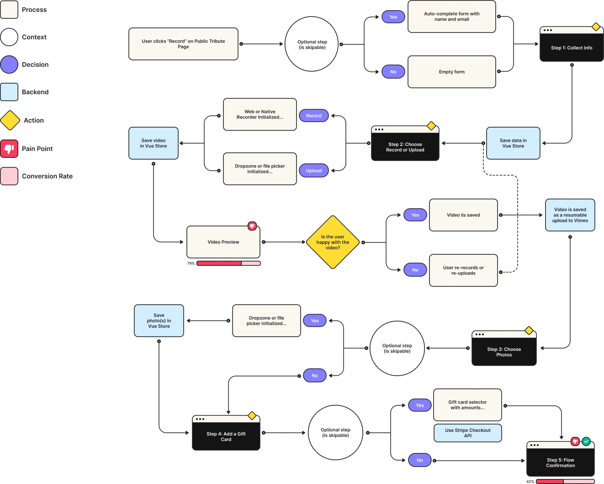

## Background & Challenges

The recording flow is the most important interaction in the Tribute platform. It's how participants actually contribute to a tribute -- recording or uploading the video messages that make the final product meaningful. Over twenty million submissions have come through this flow. When it works well, everything downstream works. When it doesn't, nothing else matters.

However, the current recording flow has significant problems:

• Dated UI and flow
• Unreliable recording — Ziggeo and the CDN were the root cause
• ~40% submission rate
• Persistent bugs
• Barely functional on mobile
• No option to upload, only record

## Project Objectives

The redesign had three clear goals:

1. **Get submission rates from 40% to at least 65%** for users who start the recording process.

2. **Kill the Ziggeo dependency** and the older CDN integration, which were the root cause of most reliability issues.

3. **Add photo uploads, gift card integration**, and as a stretch goal, resumable uploads that work in the background across the app with user-facing retry on failure.

## User Research & Analysis

### User path analysis

Aggregate conversion rates told us 33% of people submitted a video. Path analysis told us where the other 67% went. When I mapped each step of the recording flow, the story got more specific -- I could see the difference between people who bailed immediately at the record screen versus people who started recording but hit technical issues partway through. That distinction shaped the entire redesign.

Recording User Flow

### Funnel Analysis Using PostHog

PostHog's funnel tools broke it down:

1. All users intended to record a video (the entry point of our funnel).

2. 79% of users continued beyond the first video record screen.

3. However, only 42% of those users successfully completed the video submission process.

Therefore, my overall submission rate was approximately 33% from beginning to end - fairly low for a core feature.

Splitting by device made it worse -- mobile users were dropping off at higher rates across the board. And when I looked at time-per-step, users who eventually gave up were spending far too long waiting for video processing. That was the clearest signal that the technical layer was actively hurting conversion.

### The real barrier wasn't just technical

Customer surveys told us something the funnel data couldn't: a lot of users feel genuinely uncomfortable recording themselves on video. Introverts especially. There's a vulnerability to it that creates hesitation before any UI friction even enters the picture.

That meant the redesign had to work on two fronts. First, make the recording experience feel familiar, reliable, and low-pressure. Second, add photo uploads as a way for hesitant users to still contribute -- but keep it secondary. Video is what makes a Tribute a Tribute. We didn't want to give people an easy off-ramp from the core experience.

### Prototype testing with Maze

Maze testing came back strong -- high success and satisfaction rates across the redesigned flow. But the most useful finding was something we hadn't anticipated: users wanted a labeled progress bar. They needed to see where they were in the process and what was coming next. We added it, and it noticeably reduced hesitation during testing.

## Solution Design

Based on my research, I developed a detailed flow chart that identified:

*The problem areas of the current process

*Areas where conversion rates were low

*All the new features we desired to implement

Rather than building pixel-perfect Figma mockups upfront, we prototyped in Bolt.new. This let us validate flow logic and interactions faster -- we could test and iterate on the actual journey before committing to visual details.

## Technical Implementation

For the new recording flow, we implemented a modern technology stack:

*Vue.js and Tailwind CSS for the front-end

*Pinia for managing application state

*FormKit for handling forms

*VideoRecord-js for capturing video

*Custom dropzone/upload implementation

*Vimeo for direct resumable uploads

*Backblaze and Bunny for uploading photos

*Stripe for integrating e-commerce

One of the best decisions we made was on mobile. Desktop got a custom recording interface, but on mobile we used native HTML input fields to capture video on iOS and Android. Native capture was smoother and more reliable than anything we could have built ourselves, and it removed an entire class of bugs we'd been fighting.

## Additional Design Improvements

While we improved the technical foundation of the recording flow, we also made thoughtfully designed improvements to the user experience that addressed the needs of the users:

### Contextual theming

We pulled the selected Tribute theme (birthday, graduation, etc.) into the recording flow itself, placing it behind the core UI as a dynamic backdrop. This connected the recording experience to the celebration rather than making it feel like a generic upload form.

### Inline validation

We added real-time checkmarks and validation feedback at each step so users always knew their input was accepted before moving forward.

### Record vs. upload clarity

Research showed users were confused about whether they needed to record *and* upload as separate steps. We fixed this by disabling the upload button when hovering over record (and vice versa), making it clear these were two paths to the same outcome.

### Participant notes

A lot of users were re-recording multiple times because they'd forget what they wanted to say. We added a hidden notes field visible only to the participant during recording -- a simple teleprompter-style solve that cut down on retakes.

### Moments of delight

We added a pulsing effect on the action buttons and a confetti animation on the confirmation screen. Finishing a recording should feel good -- these small touches made the completion moment land.

---

## Reflection

The recording flow is deceptively simple on the surface -- record a video, submit it. But the combination of technical fragility, emotional hesitation, and cross-platform inconsistency made it one of the harder problems we tackled at Tribute. The biggest lesson was that conversion wasn't just a UX problem. The technical layer (Ziggeo, the CDN) was actively undermining trust. Users who hit a processing delay or a failed upload didn't come back for a second try. Fixing the infrastructure was as much a conversion play as any design change we made.

If I were starting this again, I'd push harder on resumable uploads from day one rather than treating it as a stretch goal. For a product where the average user is recording on a phone over mobile data, upload resilience is table stakes.