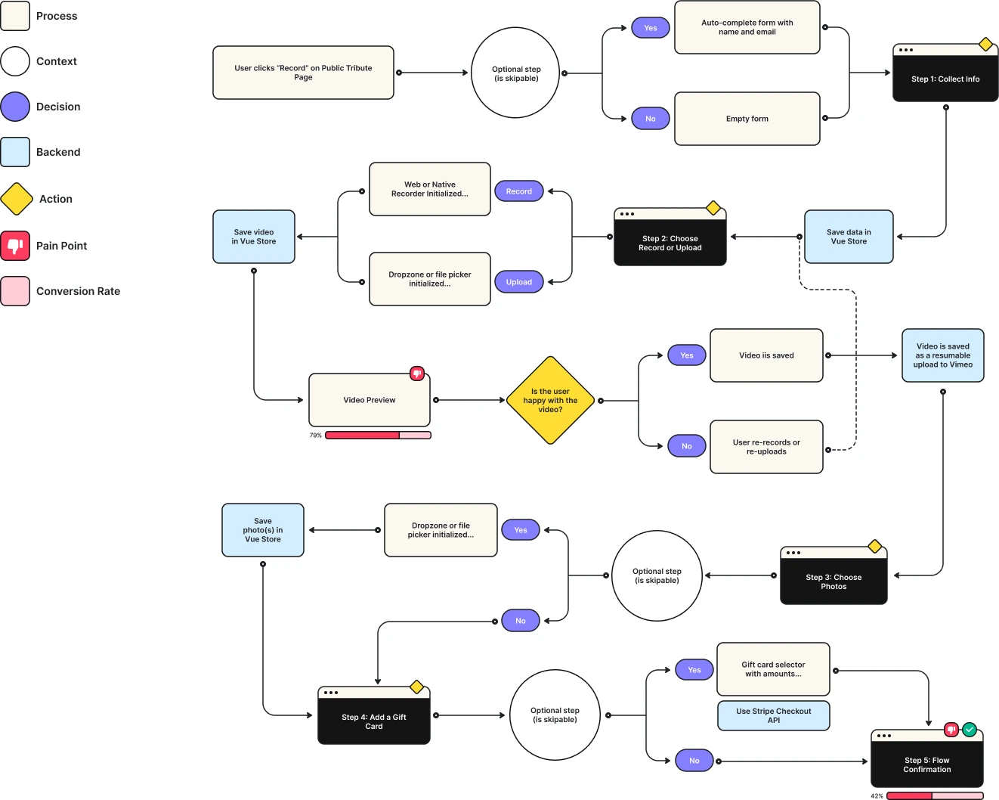

## Background & Challenges

Imagine the joyous tears of a grandmother as she watches a heartfelt video tribute compiled by her family from loving messages, celebrating her 80th birthday. This deeply personal moment, made possible through our platform, highlights the core mission of Tribute: to facilitate meaningful connections that transcend distance and time. Video submissions represent the most essential element of the Tribute experience, with over twenty million submissions received so far. The video submission process, or the "recording flow," represents more than just another feature of the Tribute Platform; it is the fundamental interaction that defines the platform's essence.

However, the current recording flow has significant problems:

•The user interface and the flow feel very dated

•The technical reliability of the recording flow is weak due to its reliance on the older CDN integration and Ziggeo

•The conversion rates are low - approximately 40% of users who begin the recording process ultimately submit a video

•Bugs are frustrating users

•The mobile experience is very subpar

•Currently, the only option is to record videos, and there is no option to upload videos

These problems are resulting in considerable friction for users and affecting our performance metrics.

## Project Objectives

Using the SMART framework, I established specific objectives for the redesign:

1. **Increase the submission rates** from 40% to at least 65% for users who begin the recording process and submit a video.

2. **Improve the technical reliability** of the recording flow by removing the problematic dependency on Ziggeo and the older CDN integration.

3. **Add new features** including:

•Photo uploads

•Gift card integration

•Stretch goal of adding a resumable upload feature that will work throughout the UI and allow users to upload in the background while navigating the app, and add the capability for users to retry failed uploads themselves

Having measurable targets for the project kept it focused and provided a means to assess its success. Additionally, it ensured we tackled both the technical issues and the new features users had requested.

## User Research & Analysis

### The Value of Using User Path Analysis

Throughout the redesign process, user path analysis was incredibly valuable, as it enabled me to see how users navigated our app and identify exactly where friction occurred. When I mapped out each step of the recording flow, I was able to see not only where users were abandoning it, but also the context of those abandonments.

This type of analysis provided information that would not have been available solely from aggregate conversion rates. For example, I was able to distinguish between users who abandoned the recording flow immediately after viewing the recording interface and those who began the recording process but experienced technical issues along the way.

Recording User Flow

Recording User Flow

### Funnel Analysis Using PostHog

Once I analyzed the data using PostHog's funnel tools, the picture became very clear:

1. All users intended to record a video (the entry point of our funnel).

2. 79% of users continued beyond the first video record screen.

3. However, only 42% of those users successfully completed the video submission process.

Therefore, my overall submission rate was approximately 33% from beginning to end - fairly low for a core feature.

Using PostHog, I further analyzed the data by device type and found that mobile users were experiencing even greater difficulty than desktop users. I also measured the time spent at each step and noted that users who eventually gave up were spending a great deal of time waiting for video processing - a clear indication that something was amiss.

### Establishing Reasonable Conversion Targets

My target of increasing the overall submission rate from 33% to at least 65% may seem ambitious, given that it is for a core feature. However, my research provided important context on the challenges of recording video for users.

My customer surveys indicated that many of our users, particularly those who consider themselves introverted, become hesitant when asked to record themselves on video. The act of recording creates a sense of vulnerability and pressure, leading some users to hesitate.

As a result, the redesign required addressing two distinct challenges:

1. **Create a feeling of familiarity and reduced intimidation** when recording video by improving the UI, providing additional clarity and ensuring that the technical aspects are reliable.

2. **Add alternative options** to the video submission process (e.g., photo uploads), while maintaining the focus on video as the primary method of submission.

3. **Strike a balance between these two methods** to ensure that we do not inadvertently discourage users from submitting video content, which is what makes a Tribute unique.

To address emotional barriers and guide users through the recording process, we designed the photo upload as a complementary feature rather than emphasizing it as a primary alternative to video submission. This way, we maintained the focus on video submission while offering users alternatives to complete the recording flow.

### Testing Our Prototype with Maze

To test our prototype, I used Maze, a result-oriented usability testing tool. The test results were very promising, with high success and satisfaction rates across the redesigned recording flow.

Although the testing confirmed my primary design decisions, it also yielded one critical piece of feedback: users wanted a clearer, labeled progress bar to help them understand the next step and where they were in the process.

This insight helped us improve the user interface, providing users with a better understanding of their place in the process and minimizing uncertainty.

## Solution Design

Based on my research, I developed a detailed flow chart that identified:

*The problem areas of the current process

*Areas where conversion rates were low

*All the new features we desired to implement

Instead of spending a lot of time creating pixel-perfect mockups in Figma, we used Bolt.new for rapid prototyping, which enabled us to iterate and validate quickly. This approach allowed us to prioritize flow logic over pixel precision, ensuring we focused on functionality and the user journey rather than getting caught up in visual details. While Figma is powerful for detailed design work, the rapid iteration enabled by Bolt.new lets us test and refine our ideas more effectively, demonstrating the intentional trade-offs in our tooling choices.

## Technical Implementation

For the new recording flow, we implemented a modern technology stack:

*Vue.js and Tailwind CSS for the front-end

*Pinia for managing application state

*FormKit for handling forms

*VideoRecord-js for capturing video

*Custom dropzone/upload implementation

*Vimeo for direct resumable uploads

*Backblaze and Bunny for uploading photos

*Stripe for integrating e-commerce

One of the best decisions we made was the way we approached mobile. While our desktop experience used a customized recording interface, the mobile experience used native HTML input fields to capture video on both iOS and Android devices. This was a massive improvement because it leveraged the OS's capabilities rather than fighting against them. Why utilize what the OS can do so well?

## Additional Design Improvements

While we improved the technical foundation of the recording flow, we also made thoughtfully designed improvements to the user experience that addressed the needs of the users:

### Providing Context

We dynamically placed placeholders behind the core flow to enable users to select the Tribute theme (birthday, graduation, congratulations, etc.) that they are celebrating. This helped create a contextual experience for the user that tied the selected theme throughout the entire process.

### Providing Instant Feedback

To provide instant feedback and reactively apply checkmarks for real-time validation, we followed best practices for form development. This instantaneous feedback to users helped alleviate their uncertainty and confusion.

### Creating Clear and Intuitive Interface Controls

One subtle yet impactful UI enhancement was the disabling of the upload button when hovering over the record button, and vice versa. Based on our research, we observed users demonstrating confusion about whether they needed to record and upload separately. This minor design decision removed the confusion and provided users with a clearer path forward.

### Including a Participant Notes Functionality

We included a "notes" section that allows participants to write notes that remain hidden from other users while recording. This solved a common issue we found in our research: many users recorded multiple versions of the video because they forgot what they wanted to say during the recording.

### Adding Moments of Delight

We included a pulsating effect on the buttons and a confetti Lottie animation on the confirmation page to celebrate the successful completion of the submission process. These small moments of delight reinforced the positive emotions associated with completing the submission process and added a bit of personality to the experience.