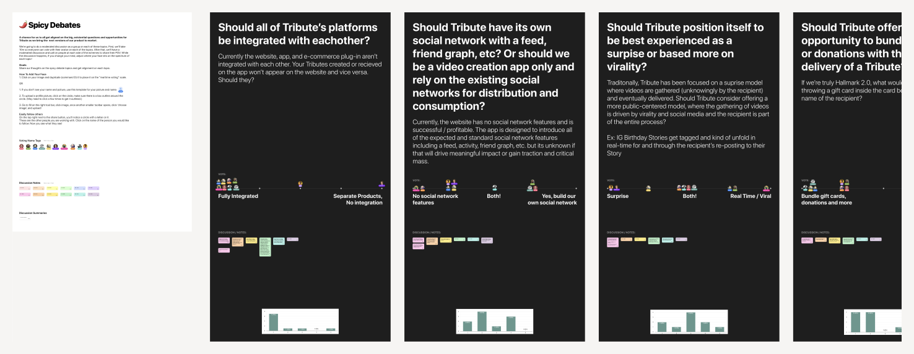
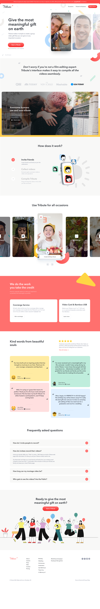

## Overview
In March 2020, during the pandemic, I became the Director of Product Design at Tribute. The company had just marked its millionth video and saw a 25x growth, largely because families missed each other. Revenue surged to $700,000 in May 2020, compared to $250,000 for the entire previous year. Tribute’s platform lets customers create video montages to celebrate important occasions. Users can upload videos, edit them together, and send a produced copy to the recipient. With only a couple of freelancers comprising the design team, I was tasked to assemble a design team and redesign the product from end to end to capitalize on the growth opportunity. This case study outlines my approach and achievements in leading the product design team to deliver a successful redesign that significantly improved the user experience and contributed to the company’s continued growth.

The old Tribute.co

## Problem
To kick off the redesign project, I conducted a brainstorming workshop with the team to uncover pain points felt by individuals and identify ways to improve the user experience. Additionally, I conducted user experience research (UXR) to determine which parts of the product resonated with users and which didn’t. The UXR revealed several issues that needed to be addressed. First, users didn’t understand what Tribute was based on the front-facing website. Second, our pricing structure was unclear. Third, the video recording process was not ideal — the record UI was buggy, and the directions were unclear. While the guts or backend of the product were functional and relatively easy to use, everything up until that point needed refinement. The challenge was to redesign these elements without disrupting the core product too much, and I was determined to lead the team to tackle this challenge head-on.

## Product vision & solution
To address the pain points identified in the UXR, my product vision was to create a seamless and intuitive user experience that would clearly communicate what Tribute was all about, simplify the pricing structure, and improve the video recording process. To achieve this vision, I needed to hire a small team of outsourced designers who were familiar and comfortable with design sprints, as we would need to work quickly to iterate and test our designs. Additionally, I wanted to ensure that we had clean analytics and funnels to track our progress and identify areas for improvement, so we leveraged GA and PostHog to accomplish this. We also cleaned up our Figma files and established a design system to ensure consistency across all user-facing pages. To build and maintain these pages, I chose Webflow, a Sass tool that allowed us to quickly and easily create and modify web pages.

To further optimize our product, I wanted to establish a culture of frequent A/B testing and integrate Google Optimize to facilitate this. I also integrated regular customer feedback loops to iteratively improve the product, ensuring that we were meeting our users’ needs and addressing their pain points. Finally, I established a process for brainstorming, documenting, and scheduling future product feature work and PLG initiatives to ensure that we were always working toward our product vision and goals. By taking these steps, we significantly improved the user experience, increased user engagement, and retention, and ultimately contributed to the company’s continued growth.

## Integration
To implement our product vision, I quickly hired two full-time designers from Venezuela and a small design agency based out of New York City to help with some of the heavy concept work. I set up weekly design sprints using various exercises such as “How might we?”, Affinity mapping, Crazy Eights, and Spicy Debates to ideate and iterate on our designs. To jumpstart our design system, I leveraged the Pegasus design system and had the small design agency conceptualize the next version of our homepage. We went through endless prototypes and ideas, refining and testing our designs until we had a few that we felt were ready for testing. To do this, we used Maze to test several new prototypes.

Spicy Debates

Based on the findings from the Maze tests, we made some tweaks and refinements to the designs before moving on to implementation. The outsourced designers worked closely with our development team to ensure that the new designs were properly implemented, and we also used Google Optimize to run A/B tests to further refine our designs. Additionally, we established a regular cadence of customer feedback loops to ensure that we were staying on track with our product vision and addressing any emerging pain points. Through this iterative process, we were able to successfully redesign Tribute from end to end while maintaining the core functionality that users loved. The new design significantly improved user engagement and retention, and the company continued to see strong growth.

The new Tribute.co

## Leveraging Vue 3 & Composition API
As the redesign journey progressed, a significant technical pivot became essential to further improve the product and cater to the evolving needs of our users. We acknowledged that to maximize the potential of our front-end design changes and provide a seamless user experience, a shift in our technology stack was crucial. Django, while robust and dependable, primarily uses a server-side rendering approach, which could lead to a slight lag in the UI interactions, especially with dynamic content like videos. Transitioning to Vue 3, a progressive JavaScript framework, was a deliberate choice driven by its adaptability, efficiency, and the advantages it provided for SPA (Single Page Application) designs which are pivotal for platforms like Tribute.

* **Utilizing Vue 3 and Composition API:** With Vue 3 came the Composition API, an enhanced feature set that allows for better logic composition and reuse. For Tribute, which relies heavily on user interactions like uploading, editing, and compiling videos, this was a game-changer. The Composition API provided a more readable and maintainable codebase, making it easier for our developers to build and iterate upon features. Using Vue 3’s reactivity system, we could effortlessly bind data to the UI, ensuring real-time feedback for users, which was especially valuable in the video editing process.
* **Structured API Calls and Decoupling:** By transitioning to a client-side framework like Vue, we could pivot from our Django templates to creating structured API calls. This separation of concerns, decoupling the frontend from the backend, enhanced both the scalability and maintainability of our platform. This allowed for better performance optimization and a more agile development cycle since the front-end and back-end teams could work more independently.
* **Iterative Integration using Vite and Mini Vue Apps:** A direct and abrupt transition in technology can often lead to disruptions, user discomfort, and unforeseen challenges. Recognizing this, we adopted an iterative approach to ensure the incorporation of Vue into our existing stack was smooth and risk-averse. Harnessing the power of Vite, a lightning-fast build tool, we developed ‘mini Vue apps’, which were smaller, self-contained Vue applications that could be embedded into our existing Django structure. This modular strategy facilitated rapid prototyping, testing, and allowed us to enjoy Vue’s benefits without disruptive overhaul. From a user’s perspective, the transition was almost invisible, introducing them to the enhanced capabilities progressively.
* **Adhering to Vue’s Best Practices:** As with any technology, the power of Vue can only be fully harnessed by adhering to its best practices. We ensured regular code reviews, utilized modular components, and made optimal use of Vue’s lifecycle hooks. This not only made our codebase cleaner but also significantly enhanced the overall performance of Tribute.
* **Enhanced User Experience:** With the asynchronous nature of Vue, pages on Tribute loaded faster, and users no longer had to endure full-page reloads. This, coupled with the dynamic capabilities of Vue 3, transformed the user experience, making interactions smoother and more intuitive, particularly in the video compilation process.

Feature matrix

In conclusion, our transition to Vue 3 and the Composition API was not just a tech stack change; it was an evolution. This shift proved instrumental in amplifying the impact of our design changes, ensuring that Tribute remains at the forefront of providing a seamless and immersive experience for users wanting to celebrate life’s special moments through videos.

## Celebrating Our Achievements
In the vast landscape of product design and development, tangible outcomes are the true testament to the efficacy of any transformation. The redesign of Tribute was not just about aesthetics or modernization; it was about optimizing user interactions, streamlining processes, and enhancing the overall user experience. As we navigated through the myriad of challenges and innovations, our data began to tell a story of success. Here’s a snapshot of some of the impressive metrics that underline our achievements:

1. Users starting a Tribute increased by 24%. This is partly in response to leveraging Typeform.
2. After various price tests, we were able to increase AOV by ~$30 without negatively affecting overall conversions.
3. Participation amongst invitees to Tributes increased by 21% due to a redesign of the record flow.
4. The record rate (the rate at which invited participants started and completed the record flow) increased from 89% to 98%.
5. The checkout conversion rate increased by 16%.

These numbers not only validate our strategic and design choices but also provide a solid foundation for Tribute’s next chapter of growth and innovation.

## Further Design Efforts
Aside from the user-facing parts of the site like the homepage and marketing page, some other areas of the site we redesigned:

1. Authentication
2. Manage
3. Public Tribute page
4. Record flow
5. Checkout
6. Claiming a gift
