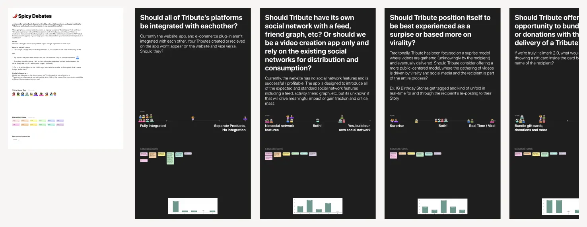
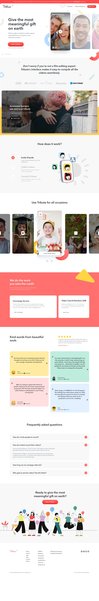
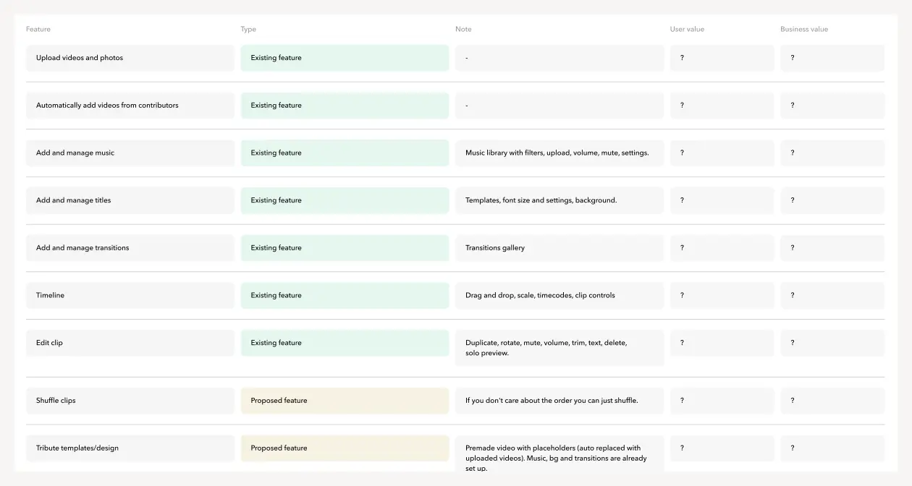

## Background

I joined Tribute as Director of Product Design in late March 2020, right as the pandemic was accelerating. Tribute lets people organize group video montages for birthdays, retirements, farewells -- occasions where showing up matters. With in-person gatherings suddenly off the table, demand surged. Revenue went from roughly $250K in 2019 to $700K by May 2020, and the platform had crossed one million videos created.

The product couldn't keep up with that growth. When I arrived, the design team was a handful of freelancers with no system or shared process. I was brought in to hire a real team and rebuild the product from the ground up.

The old Tribute.co

## Problem

I started with a brainstorming session with the design team to map out pain points, then ran user research to validate what we were hearing. Three issues came back consistently:

1. **The homepage didn't explain the product.** New visitors couldn't tell what Tribute was or how it worked.
2. **Pricing was confusing.** Users didn't understand what they were paying for or when.
3. **The recording flow was broken.** The UI was dated, the recorder was unreliable, and mobile was barely functional.

The backend was solid. Everything user-facing needed work. The challenge was rebuilding those three areas without disrupting what was already working underneath.

## Solution

The approach was straightforward: make the product clear, make pricing simple, and make recording reliable.

Before touching any UI, we cleaned up our Figma files and started building a design system so the team could work from shared components instead of one-off screens. We set up GA and PostHog for funnel tracking -- prior to this, there was limited visibility into where users were dropping off.

We also established two practices that shaped everything going forward. First, continuous A/B testing through Google Optimize so design decisions were validated with data, not just instinct. Second, a regular cadence for collecting customer feedback so we could catch emerging pain points early rather than waiting for them to become systemic.

## Implementation

I hired two full-time designers from Venezuela and brought on a small NYC design agency for heavier concept work. We ran weekly design sprints using exercises like Crazy Eights, Affinity Mapping, and what we called Spicy Debates -- structured arguments over competing directions that forced the team to articulate tradeoffs rather than default to consensus.

We bootstrapped the design system off of Pegasus and had the agency lead the homepage concept work. From there, we iterated on prototypes and tested them through Maze. The results confirmed most of our direction and flagged a few areas that needed refinement before handoff.

The designers worked directly alongside engineering during implementation. After launch, we ran A/B tests on the live product through Google Optimize to continue tuning. The redesign shipped end-to-end without breaking the core functionality users already relied on.

Spicy Debates

The new Tribute.co

## Moving to Vue 3

As the redesign progressed, it became clear that Django's server-side rendering was holding back the UI improvements we were making. Video-heavy interactions -- uploading, editing, compiling -- felt sluggish because every action required a round trip. We needed a client-side framework.

We chose Vue 3 for its flexibility and the Composition API's support for reusable, modular logic. The migration strategy was critical: rather than a risky full rewrite, I planned an iterative rollout using Vite to build small Vue apps that could be embedded directly into the existing Django structure. Each piece could be prototyped, tested, and deployed independently. The transition was nearly invisible to users.

Decoupling the frontend from the backend also gave our teams more independence. Frontend and backend could ship on their own schedules, and the codebase became significantly easier to maintain and extend.

The result was a noticeably faster product. Pages loaded without full reloads, video interactions felt responsive, and we had a modern foundation that could support everything we wanted to build next.

Feature matrix

## Outcomes

The redesign moved every metric we were tracking:

1. **User-generated tributes up 24%**, partly driven by a Typeform integration that lowered the barrier to starting.
2. **AOV increased by ~$30** after multiple rounds of pricing tests, with no negative impact on conversion.
3. **Invitee participation up 21%** following the record flow redesign.
4. **Record flow completion went from 89% to 98%.** The biggest driver was a simplified UI with a progress indicator -- users could see where they were and what was next, which cut down on confusion and drop-off.
5. **Checkout conversion up 16%.**

These gave us a strong baseline and clear signal on where to push next.

## What came next

The initial redesign focused on the homepage, marketing pages, and core flows. From there, we continued into authentication, the tribute management dashboard, public tribute pages, the record flow (covered in a separate case study), checkout, and the gift claim experience.

---

## Reflection

This was the project that set the foundation for everything Tribute has shipped since. When I joined, there was no design system, no analytics infrastructure, no structured testing process, and no full-time design team. Building all of that while simultaneously redesigning the product was the real challenge -- not any individual UI decision.

The biggest thing I'd do differently is push the Vue migration earlier. We spent months improving the frontend experience within Django's constraints before accepting that client-side rendering was a prerequisite for the kind of responsiveness users expected. Starting that conversation sooner would have saved time.
